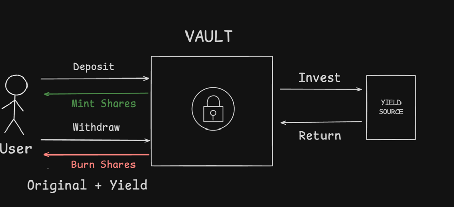
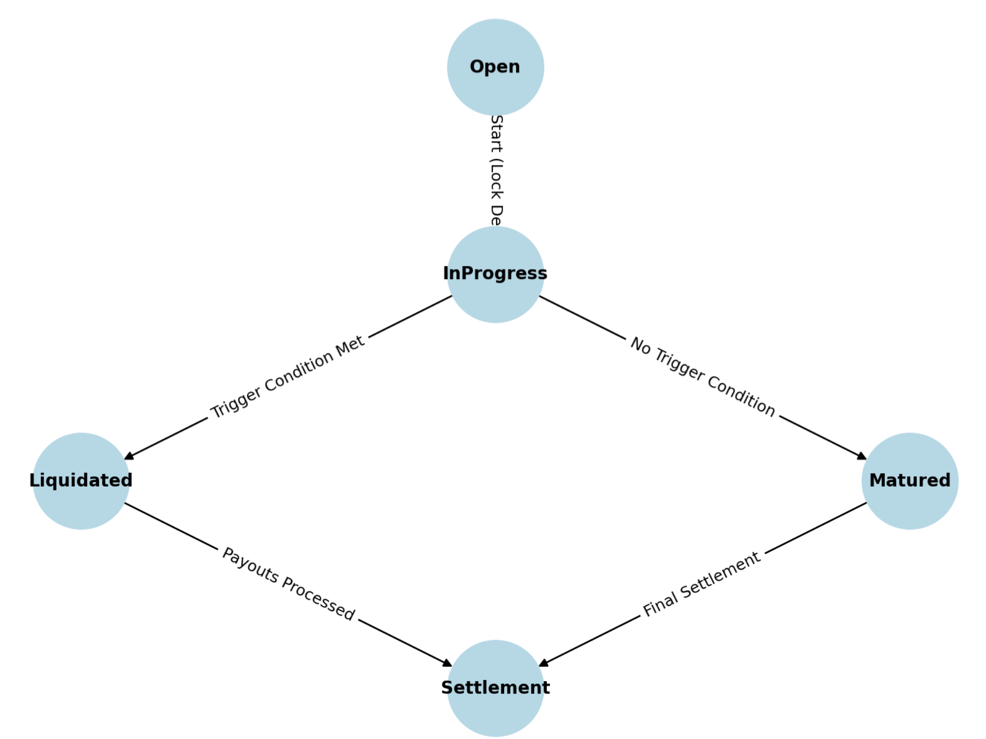
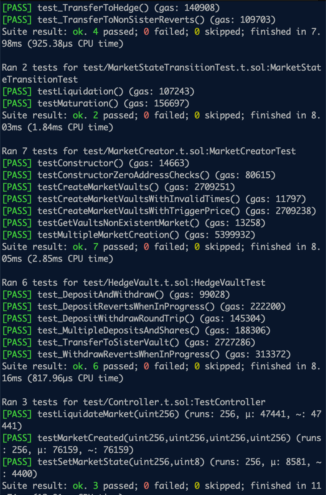
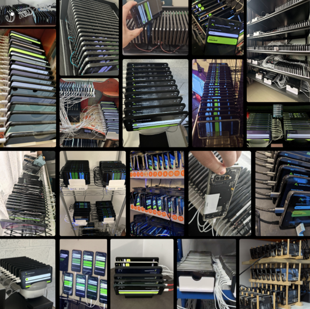

# Bit Shield

## What Did we Build and Why?

We set out to create something engaging for BTC holders—an opportunity to have fun while earning real yield. Our goal was to tackle a real-world problem while enabling Bitcoiners to generate tangible returns.

In just a 20-hour sprint, a solo dev and his Claude 3.7 sidekick made decent progress. Here’s what they’ve accomplished so far: 

We set out to fetch Turkish Lira data and offer people a way to hedge against their inflationary fiat using Bitcoin—a worthy goal. Stacking sats > holding fiat.

## How did we do it? - Risk/Hedge Protocol

We built a protocol on top of ERC4626 primitive




The protocol consists of four main contracts:

* **Controller**: This is the main entry point for all frontend interactions. It orchestrates the entire system, processing oracle data, managing market states, and facilitating market creation.
* **MarketCreator**: This contract is responsible for creating and managing risk and hedge vaults for each market. It is primarily called by the Controller.
* **RiskVault**: This contract represents the "risk" side of a market, where users can deposit funds to take on risk.
* **HedgeVault**: This contract represents the "hedge" side of a market, where users can deposit funds to hedge against the risks.

and the controller basically controls the state of the protocol, that is the essence of how it all works - 

## Explanation of Each State

### 1. Open
- Users can freely **deposit and withdraw** from both the risk and hedge vaults.
- The market has **not yet reached** its event start time.

### 2. InProgress
- Triggered automatically **when the event start time is reached**.
- **Deposits and withdrawals are locked** to prevent manipulation during the risk event.
- The market remains in this state until **the event concludes**.

### 3. Liquidated
- Occurs if, at the end of the event, the **trigger price condition is breached**.
- The **hedge vault is paid out** from the risk vault’s assets.
- **Deposits and withdrawals are re-enabled**, allowing users to collect proceeds or remaining capital.

### 4. Matured
- Occurs if the event **finishes without hitting the trigger price**.
- No payout is made from the risk vault to the hedge vault.
- **Deposits and withdrawals are re-enabled** for final settlement.



## Frontend Integration

All frontend interactions with the protocol should be directed through the **Controller** contract. This ensures proper access control, consistent behavior, and simplified integration. Below are the external entry points available for frontend applications:

### External Entry Points

#### Controller Contract

The Controller serves as the central point of interaction with the protocol:

1. **Market Creation**:
   - `createMarket(uint256 eventStartTime, uint256 eventEndTime, uint256 triggerPrice)` - Create a market with custom parameters
   - `createMarket(uint256 eventStartTime, uint256 eventEndTime)` - Create a market with custom timing and default trigger price
   - `createMarket()` - Create a market with all default parameters

2. **Market Management**:
   - `startMarket(uint256 marketId)` - Transition a market from Open to InProgress state
   - `matureMarket(uint256 marketId)` - Mature a market after event end time
   - `processOracleData(uint256 marketId, uint256 currentPrice, uint256 timestamp)` - Process oracle data to potentially liquidate or mature a market

3. **Market Queries**:
   - `marketStates(uint256 marketId)` - Get the current state of a market (Open, InProgress, Matured, or Liquidated)
   - `getMarketTiming(uint256 marketId)` - Get the start and end time of a market
   - `getMarketTriggerPrice(uint256 marketId)` - Get the trigger price of a market
   - `getMarketVaults(uint256 marketId)` - Get the risk and hedge vault addresses for a market
   - `isDepositAllowed(uint256 marketId)` - Check if deposits are allowed for a market
   - `isWithdrawAllowed(uint256 marketId)` - Check if withdrawals are allowed for a market

#### Vault Contracts (ERC4626)

For direct token interactions, the ERC4626 standard functions must be called directly on the vault contracts:

1. **RiskVault and HedgeVault**:
   - `deposit(uint256 assets, address receiver)` - Deposit assets into the vault
   - `mint(uint256 shares, address receiver)` - Mint shares in the vault
   - `withdraw(uint256 assets, address receiver, address owner)` - Withdraw assets from the vault
   - `redeem(uint256 shares, address receiver, address owner)` - Redeem shares for assets

These functions include internal checks to verify with the Controller if the operations are allowed based on the current market state.

### Integration Workflow

A typical frontend integration would follow this pattern:

1. Call `controller.createMarket()` to create a new market
2. Get the vault addresses with `controller.getMarketVaults(marketId)`
3. Allow users to deposit into vaults during the Open state
4. Call `controller.startMarket(marketId)` when ready to start the market
5. Process oracle updates with `controller.processOracleData()` during the event
6. After the event ends, the market is either liquidated or matured
7. Allow users to withdraw their funds from the appropriate vault

## Usage

### Build

```shell
$ forge build
```

### Test

```shell
$ forge test
```


## Deployment

### RootSock Deployed Contracts
Note: Production will use a wrapped or LST BTC token, but we could not find one in testnet to test with, 
so we tested with rif as a placeholder. 

* Asset(Rif):  0x19F64674D8A5B4E652319F5e239eFd3bc969A1fE 

* Controller: https://explorer.testnet.rootstock.io/address/0x741146144f6272013557c4facfb2b583f9a1f30c

* MArket Creator: https://explorer.testnet.rootstock.io/address/0x4a14fb4c5ca93f6638680eb010b8e565a93d6c74 

* Hedge Vault (Liquidated) https://explorer.testnet.rootstock.io/address/0xfee5d66934ccedc4b4602ee872b899c5c64c4ec7

* Risk liq vault(Liquidated) https://explorer.testnet.rootstock.io/address/0xa5ab77d3e481ab0c7f9fcfe3b3d9c04dcabff057

* Hedge Vault (Matured) https://explorer.testnet.rootstock.io/address/0x31fb5005b852cfd91a9dead82fa34873e89a572b 

* Risk Vault (Matured) https://explorer.testnet.rootstock.io/address/0x0d328a8994decca266508ea3106b2d68cb9111fc   

###  Bob Deployed Contracts 
Mote, we used USDC as a standin ERC-20 token, but think of it as sBTC, any BTC but uniBTC 

* Controller: https://bob-sepolia.explorer.gobob.xyz/address/0xA6A0f612A764B23CdEffac61Fe677380Ac7f5f32?tab=contract

* Market Creator https://bob-sepolia.explorer.gobob.xyz/address/0x55ED163F184b162F708E9d79C303D65a573508AE?tab=contract

* Hedge Vault (Liquidated): https://bob-sepolia.explorer.gobob.xyz/address/0xbe6bB2230F9Eb6C94861Aad91d661FAd14D26452?tab=contract

* Risk liq vault(Liquidated): https://bob-sepolia.explorer.gobob.xyz/address/0xcf09463De1e4B06719F48cA9E7Bd623919E4A1cC?tab=contract

* Hedge Vault (Matured):  https://bob-sepolia.explorer.gobob.xyz/address/0x4919da093614EC2F829715454cBC355B212CFB30?tab=contract

* Risk Vault (Matured):  https://bob-sepolia.explorer.gobob.xyz/address/0x52f41Fb065d6CFBd68c6BA2f06b2BFd0b711a27e?tab=contract

## Other Bob Things: 

* Bob Gateway Strategy Contracts 
* https://github.com/enderNakamoto/bit_shield_bob_strategy

This is no where done, but it shows how you can gateway to put BTC directly into our strategy 

## FrontEnd 
### For Rootstack and BOB
* UI - bitshield-btc.vercel.app/
* UI repo - https://github.com/enderNakamoto/bit_shield_ui

## Oracle - How are you getting real world data: 

Acurast TEE - runs any nodejs script in a cluster 

* works with Bob out of the box, with ootstock you have to wrangle it a bit 


```
const destination = "0x41bE4666a074BBc1283fC09385D91b32B103A865";
const XE_ACCOUNT_ID = "YOUR_XE_ACCOUNT_ID";
const XE_API_KEY = "YOUR_XE_API_KEY";
const FROM_CURRENCY = "TRY";
const TO_CURRENCY = "USD";
const AMOUNT = 1000;

// Create authorization header for XE API
const authHeader = 'Basic ' + Buffer.from(`${XE_ACCOUNT_ID}:${XE_API_KEY}`).toString('base64');

httpGET(
    `https://xecdapi.xe.com/v1/convert_to?from=${FROM_CURRENCY}&to=${TO_CURRENCY}&amount=${AMOUNT}`,
    {
        "accept": "application/json",
        "Authorization": authHeader
    },
    (response, _certificate) => {
        // Parse the XE API response
        const responseData = JSON.parse(response);
        // Extract the mid value
        const midValue = responseData.from[0].mid;
        // Scale the price for blockchain (multiply by 10^18)
        const price = midValue * 10 ** 18;
        const bytes = "0x" + price.toString(16).padStart(64, '0');
        const payload = "0x" + *STD*.chains.ethereum.abi.encode(bytes);
        
        *STD*.chains.ethereum.fulfill(
            "https://testnet.rpc.gobob.xyz",
            destination,
            payload,
            {
                methodSignature: "fulfill(bytes)",
                gasLimit: "9000000",
                maxFeePerGas: "2550000000",
                maxPriorityFeePerGas: "2550000000",
            },
            (opHash) => {
                console.log("Succeeded: " + opHash)
            },
            (err) => {
                console.log("Failed: " + err)
            },
        )
    },
    (err) => {
        console.log("Failed: " + err)
    }
);
```
## For RootStock: (Ran out of time):

* https://github.com/enderNakamoto/bit_shield_oracle



