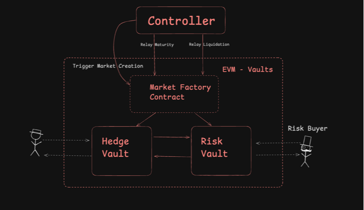

# Bit Shield

* UI - bitshield-btc.vercel.app/
* UI repo - https://github.com/enderNakamoto/bit_shield_ui

* Bob Gateway Strategy Contracts 
* https://github.com/enderNakamoto/bit_shield_bob_strategy

## Architecture Overview
The architecture of this project is designed to facilitate the creation and management of risk markets, where users can Underwrite (Invest in Insurance/Provide Liquidity) or Hedge against various types of risks using BTC.

The system consists of four main components:

* **Controller**: This is the main entry point for all frontend interactions. It orchestrates the entire system, processing oracle data, managing market states, and facilitating market creation.
* **MarketCreator**: This contract is responsible for creating and managing risk and hedge vaults for each market. It is primarily called by the Controller.
* **RiskVault**: This contract represents the "risk" side of a market, where users can deposit funds to take on risk.
* **HedgeVault**: This contract represents the "hedge" side of a market, where users can deposit funds to hedge against the risks.

#### Controller

The `Controller` contract serves as the primary interface for interacting with the protocol:

1. **Market Management**: Handles starting, maturing, and liquidating markets based on market conditions and oracle data.

2. **State Control**: Manages the state transitions of markets (Open → InProgress → Matured/Liquidated).

3. **Market Creation**: Provides proxy functions to create new markets through the `MarketCreator`.

#### MarketCreator

The `MarketCreator` contract creates and manages market vaults:

1. **Market Creation**: The `createMarketVaults()` function allows the creation of a new risk and hedge vault pair for a given market.

2. **Market Lookup**: The `getVaults()` function allows retrieving the addresses of the risk and hedge vault addresses for a given market.

The `MarketCreator` contract maintains a mapping of market IDs to the corresponding risk and hedge vault addresses.

#### RiskVault and HedgeVault

The `RiskVault` and `HedgeVault` contracts represent the "risk" and "hedge" sides of a market, respectively. They share a similar structure and functionality:

1. **Deposit and Withdrawal**: Users can deposit funds into the vaults and withdraw their shares later.

2. **Asset Transfer**: The vaults can only transfer assets to their "sister" vault, as controlled by the Controller.

3. **Ownership**: The HedgeVault contract has an owner, which is the MarketCreator contract.

The vaults inherit from the **ERC4626** standard, which provides a standard interface for tokenized vaults.

The tests provided in the project demonstrate the expected usage and behavior of the system.




## Frontend Integration

All frontend interactions with the protocol should be directed through the **Controller** contract. This ensures proper access control, consistent behavior, and simplified integration. Below are the external entry points available for frontend applications:

### External Entry Points

#### Controller Contract

The Controller serves as the central point of interaction with the protocol:

1. **Market Creation**:
   - `createMarket(uint256 eventStartTime, uint256 eventEndTime, uint256 triggerPrice)` - Create a market with custom parameters
   - `createMarket(uint256 eventStartTime, uint256 eventEndTime)` - Create a market with custom timing and default trigger price
   - `createMarket()` - Create a market with all default parameters

2. **Market Management**:
   - `startMarket(uint256 marketId)` - Transition a market from Open to InProgress state
   - `matureMarket(uint256 marketId)` - Mature a market after event end time
   - `processOracleData(uint256 marketId, uint256 currentPrice, uint256 timestamp)` - Process oracle data to potentially liquidate or mature a market

3. **Market Queries**:
   - `marketStates(uint256 marketId)` - Get the current state of a market (Open, InProgress, Matured, or Liquidated)
   - `getMarketTiming(uint256 marketId)` - Get the start and end time of a market
   - `getMarketTriggerPrice(uint256 marketId)` - Get the trigger price of a market
   - `getMarketVaults(uint256 marketId)` - Get the risk and hedge vault addresses for a market
   - `isDepositAllowed(uint256 marketId)` - Check if deposits are allowed for a market
   - `isWithdrawAllowed(uint256 marketId)` - Check if withdrawals are allowed for a market

#### Vault Contracts (ERC4626)

For direct token interactions, the ERC4626 standard functions must be called directly on the vault contracts:

1. **RiskVault and HedgeVault**:
   - `deposit(uint256 assets, address receiver)` - Deposit assets into the vault
   - `mint(uint256 shares, address receiver)` - Mint shares in the vault
   - `withdraw(uint256 assets, address receiver, address owner)` - Withdraw assets from the vault
   - `redeem(uint256 shares, address receiver, address owner)` - Redeem shares for assets

These functions include internal checks to verify with the Controller if the operations are allowed based on the current market state.

### Integration Workflow

A typical frontend integration would follow this pattern:

1. Call `controller.createMarket()` to create a new market
2. Get the vault addresses with `controller.getMarketVaults(marketId)`
3. Allow users to deposit into vaults during the Open state
4. Call `controller.startMarket(marketId)` when ready to start the market
5. Process oracle updates with `controller.processOracleData()` during the event
6. After the event ends, the market is either liquidated or matured
7. Allow users to withdraw their funds from the appropriate vault

## Usage

### Build

```shell
$ forge build
```

### Test

```shell
$ forge test
```

### Format

```shell
$ forge fmt
```

### Gas Snapshots

```shell
$ forge snapshot
```

### Anvil

```shell
$ anvil
```

### Deployment

The project includes several deployment scripts for different environments:

#### Testnet Deployment

```shell
$ forge script script/DeployTestnet.s.sol:DeployTestnetScript --rpc-url <testnet_rpc_url> --private-key <your_private_key> --broadcast
```

#### Mainnet Deployment

```shell
$ forge script script/DeployMainnet.s.sol:DeployMainnetScript --rpc-url <mainnet_rpc_url> --private-key <your_private_key> --broadcast
```

**Important**: After deployment, note the addresses of the deployed contracts, especially the Controller address which will be used for all frontend interactions.

#### Market Management

Once deployed, you can create and manage markets using the ManageMarket script:

1. **Create a Market**:
```shell
$ forge script script/ManageMarket.s.sol:ManageMarketScript --rpc-url <rpc_url> --private-key <private_key> --broadcast --env-file .env -vvv
```
Set the following environment variables in `.env`:
```
ACTION=create
CONTROLLER=<controller_address>
EVENT_START_TIME=<unix_timestamp>
EVENT_END_TIME=<unix_timestamp>
TRIGGER_PRICE=<price_in_wei>
```

2. **Start a Market**:
```
ACTION=start
CONTROLLER=<controller_address>
MARKET_ID=<market_id>
```

3. **Liquidate a Market** (for testing):
```
ACTION=liquidate
CONTROLLER=<controller_address>
MARKET_ID=<market_id>
```

4. **Mature a Market**:
```
ACTION=mature
CONTROLLER=<controller_address>
MARKET_ID=<market_id>
```

### Help

```shell
$ forge --help
$ anvil --help
$ cast --help
```
